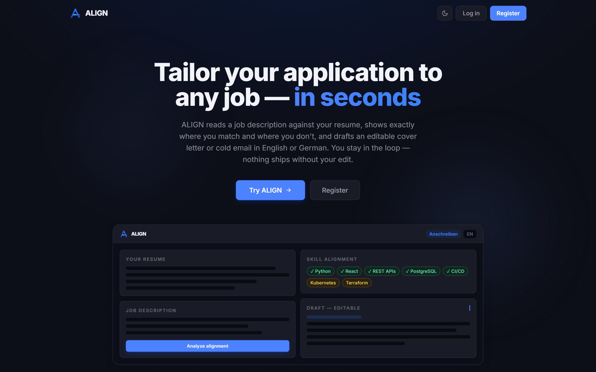

# ALIGN — AI-Driven Professional Alignment Engine



ALIGN reads a job description against your resume, shows exactly where you match and where you don't, and drafts an editable cover letter (Anschreiben) or cold email in English or German. It's a human-in-the-loop workspace for job seekers — you stay in control; nothing ships without your edit.

---

## 🚀 Features

*   **Skill alignment matrix:** Top matching skills (with evidence) vs. crucial gaps, plus an in-range fit score — enforced through a strict Pydantic schema so the model can't return junk.
*   **Editable drafts:** One-page Anschreiben (strict cover letter) or sub-200-word cold email, in **English or German**. You refine every result in the Draft Editor before it goes anywhere.
*   **Skill Coach (RAG):** Turns each skill gap into a grounded upskilling plan. Gaps are embedded and matched against a curated knowledge base in **pgvector** (cosine KNN); Gemini writes advice drawn *only* from the retrieved cards and cites its source — auditable, not hallucinated.
*   **Accounts (optional):** Email/password login via Supabase Auth. Guests get the full analyzer with nothing persisted; signed-in users get history, a resume vault, saved jobs, and insights.
*   **History, vault & insights:** Every run is snapshotted and reloadable; resumes and jobs are reusable; insights aggregate your most-matched skills vs. recurring gaps, plus token usage and estimated cost.
*   **Quota & usage tracking:** Append-only run log with a daily per-user limit (`DAILY_ANALYSIS_LIMIT`, default 20, resets midnight UTC) — keeps the project within the Gemini free tier.

---

## 🛠️ Tech Stack

*   **Frontend:** React 18 + Vite + Tailwind CSS — viewport-locked 50/50 split workspace, dark/light mode, talks to Supabase directly under RLS.
*   **Backend:** FastAPI + the official `google-genai` SDK (`gemini-2.5-flash`) with Structured Outputs; verifies Supabase JWTs, enforces quotas, and serves the RAG Skill Coach.
*   **Data & Auth:** Supabase (Postgres + Auth + Row-Level Security) with the **pgvector** extension for the skill knowledge base.
*   **AI:** Google Gemini — `gemini-2.5-flash` for analysis/drafting, `gemini-embedding-001` (768-dim) for retrieval.
*   **Deployment:** Vercel.

---

## ⚙️ Local Development

Follow these steps to get the full stack running on your machine.

### Prerequisites

*   **Node.js 18+** and **Python 3.10+**

```bash
node -v
python --version
```

*   A free **Supabase** project and a **Gemini API key**.

### 1. Supabase (once)

1.  Create a project at https://supabase.com.
2.  Open **SQL Editor → New query**, paste the contents of [`supabase/schema.sql`](supabase/schema.sql), and run it. This creates the tables + RLS policies, enables the `vector` extension, and adds the pgvector skill knowledge base + the `match_skill_kb` KNN function.
3.  Grab the **Project URL**, **anon public key**, and **service_role key** from *Project Settings → API*.

### 2. Backend (FastAPI)

```powershell
cd backend
python -m venv .venv
.\.venv\Scripts\Activate.ps1
pip install -r requirements.txt
```

Create `backend/.env` (see [`backend/.env.example`](backend/.env.example)):

```
GEMINI_API_KEY=...
SUPABASE_URL=https://<project-ref>.supabase.co
SUPABASE_ANON_KEY=...
SUPABASE_SERVICE_ROLE_KEY=...
DAILY_ANALYSIS_LIMIT=20
```

Ingest the skill knowledge base into pgvector (once, and after editing [`app/data/skill_kb.json`](backend/app/data/skill_kb.json)):

```powershell
python -m scripts.ingest_kb
```

### 3. Frontend (React + Vite)

Create `frontend/.env` (see [`frontend/.env.example`](frontend/.env.example)):

```
VITE_SUPABASE_URL=https://<project-ref>.supabase.co
VITE_SUPABASE_ANON_KEY=...
```

```powershell
cd frontend
npm install
```

> If the `VITE_SUPABASE_*` vars are missing, the app silently falls back to guest-only mode.

### 4. Run the stack

From the repo root, start both servers with one command:

```powershell
.\dev.ps1           # backend + frontend, each in its own window
.\dev.ps1 -Same     # both in the current terminal (interleaved output)
```

<details>
<summary>Or start the two dev servers manually in separate terminals</summary>

```powershell
# Terminal 1 — backend
cd backend; .\.venv\Scripts\Activate.ps1; uvicorn main:app --reload --port 8000

# Terminal 2 — frontend
cd frontend; npm run dev
```

</details>

Open **http://localhost:5173** — the Vite dev server proxies `/api/*` to the backend on port 8000.

> **Vercel:** set the `VITE_SUPABASE_*` vars (frontend) and `GEMINI_API_KEY` + `SUPABASE_*` vars (backend) in the project's environment settings.

---

## 🧪 Testing

The backend ships with an offline `pytest` suite (no real Gemini or Supabase calls) focused on the LLM boundary — schema enforcement, golden-set regression over recorded model outputs, and full API-pipeline tests with the AI mocked.

```powershell
cd backend
.\.venv\Scripts\Activate.ps1
pip install -r requirements-dev.txt
pytest --cov=app --cov=main --cov-report=term-missing
```

What's covered:

*   **Schema enforcement** ([`tests/test_schemas.py`](backend/tests/test_schemas.py)) — proves the `AnalysisResponse` contract rejects malformed model output instead of passing it downstream.
*   **Golden-set regression** ([`tests/test_golden_regression.py`](backend/tests/test_golden_regression.py)) — replays recorded Gemini responses through the live `run_analysis` pipeline.
*   **Gemini service** ([`tests/test_gemini_service.py`](backend/tests/test_gemini_service.py)) — network boundary mocked; verifies the schema is wired in as `response_schema` and token accounting.
*   **API pipeline** ([`tests/test_analyze_endpoint.py`](backend/tests/test_analyze_endpoint.py), [`tests/test_analyze_authenticated.py`](backend/tests/test_analyze_authenticated.py)) — validation, error mapping (500/502/429/401), quota enforcement, and the signed-in persistence path.
*   **RAG / vector search** ([`tests/test_embedding_service.py`](backend/tests/test_embedding_service.py), [`tests/test_retrieval_service.py`](backend/tests/test_retrieval_service.py), [`tests/test_skill_coach.py`](backend/tests/test_skill_coach.py)) — embeddings, the pgvector RPC payload, the citation guard, and the honest ungrounded fallback.

Current coverage: **96%** across `app/` and `main.py`.

### Evaluating model quality

The pytest suite mocks Gemini, so it checks the *pipeline*, not the *model*. To measure how the live model actually performs, run the evaluation harness over a labelled dataset of ~15 resume + job-description pairs:

```powershell
cd backend
python -m eval.run            # all cases
python -m eval.run --limit 5  # quick sample
```

It calls the real Gemini API and reports schema-validity, structural-compliance, skill-gap hit-rate, and score calibration. It runs cases sequentially with a delay and retries on rate limits, so it stays within the Gemini **free tier** (~15 calls per full run).

---

## 📖 Usage

1.  Sign in (or **Continue as guest** — fully functional, nothing saved).
2.  Pick a **mode** (Anschreiben or Email Outreach) and a **language** (EN / DE) in the header.
3.  Paste your resume (top-left) and the job description (bottom-left) — signed-in users can **Save** either to their vault.
4.  Hit **Run Alignment Analysis**.
5.  Review the **Semantic Analysis** tab (top matches, crucial gaps), then refine the result in the **Draft Editor** tab.
6.  Browse **History**, **Resumes**, **Jobs**, and **Insights** from the header nav.

---

## 🔌 API

`POST /api/analyze` — optional `Authorization: Bearer <supabase-access-token>` header.

```json
{
  "resume_text": "...",
  "job_description_text": "...",
  "mode": "anschreiben | email",
  "language": "en | de",
  "resume_id": "optional vault id",
  "job_description_id": "optional saved-job id"
}
```

Returns `{ "matching_skills": [...], "skill_gaps": [...], "generated_draft": "...", "analysis_id": "...", "usage": { "used_today": 3, "daily_limit": 20 }, "prompt_tokens": 1234, "output_tokens": 567 }` (persistence fields are `null` for guests). Responds `429` when the daily quota is exhausted.

`POST /api/skill-coach` — retrieval-augmented upskilling guidance for a set of skill gaps (typically the `skill_gaps` from an `/analyze` run).

```json
{
  "skill_gaps": ["Kubernetes", "Terraform", "gRPC"],
  "language": "en | de"
}
```

Each gap is embedded and matched against the pgvector knowledge base; the retrieved cards ground a Gemini call that returns `{ "summary": "...", "items": [{ "gap": "...", "guidance": "...", "source_slug": "..." }], "sources": [...], "grounded": true }`. When the knowledge base isn't configured, it responds with `grounded: false` and an empty plan rather than inventing advice.
