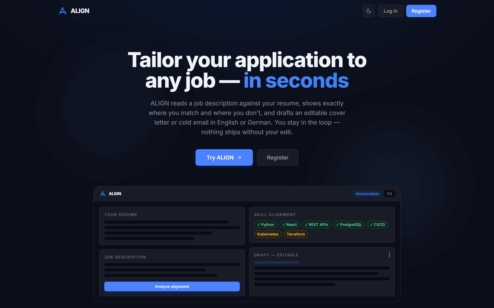

# ALIGN — AI-Driven Professional Alignment Engine



ALIGN reads a job description against your resume, shows exactly where you match and where you don't, and drafts an editable cover letter (Anschreiben) or cold email in English or German. It's a human-in-the-loop workspace for job seekers — you stay in control; nothing ships without your edit.

---

## 🚀 Features

*   **Skill alignment matrix:** Top matching skills (with evidence) vs. crucial gaps, plus an in-range fit score — enforced through a strict Pydantic schema so the model can't return junk.
*   **Editable drafts:** One-page Anschreiben (strict cover letter) or sub-200-word cold email, in **English or German**. You refine every result in the Draft Editor before it goes anywhere.
*   **Draft preferences:** Choose Neutral (default), Direct, or Friendly wording and optionally add personal motivation. Preferences are restored from saved history for regeneration. Letters have a 270-word body ceiling without a forced minimum; the existing export layout and rich-text pagination remain unchanged.
*   **PDF and Word downloads:** Preview and export the current edited draft as a one-page A4 PDF or editable `.docx`. Cover letters use a right-aligned sender and date, a left-aligned recipient, a bold subject, and extra space before the subject and sign-off. Filenames follow `Anschreiben_Company_Applicant`, using names from the draft and omitting missing details. The layout adjusts spacing and font size (10–11.5 pt) to fit; drafts that exceed a readable single page must be shortened before downloading. Exports run in the browser, including for guests.
*   **Skill Coach (RAG):** Turns each skill gap into a grounded upskilling plan. Gaps are embedded and matched against a curated knowledge base in **pgvector** (cosine KNN); The selected AI provider writes advice drawn *only* from the retrieved cards and cites its source — auditable, not hallucinated.
*   **Accounts (optional):** Email/password login via Supabase Auth. Guests can analyze and export without saved application history; signed-in users get history, a resume vault, saved jobs, and insights. Guest quota counters store only a keyed hash of the network address, never application content.
*   **History, vault & insights:** Every run is snapshotted and reloadable; resumes and jobs are reusable; insights aggregate your most-matched skills vs. recurring gaps, plus token usage and estimated cost.
*   **Quota & usage tracking:** Atomic daily reservations cap analysis and coaching attempts independently before any AI call. Defaults: 20 analyses and 20 learning plans per signed-in user; 5 of each per guest network address. Limits reset at midnight UTC. Failures and cancellations count as attempts; a validation retry stays within the same reservation. The append-only usage log continues to record successful signed-in analyses for cost estimates.
*   **Safer editing:** Signed-in draft saves run in order with visible save/retry status. Pending edits are flushed before switching sections, opening another analysis, generating again, or signing out. Unsent edits are kept on the device until synced and can be recovered by reopening their analysis in History. Guests can export their drafts and receive a warning before edited drafts are replaced or discarded.
*   **Verified AI output:** Resume quotes are checked against normalized resume text. Emails stay under 200 words; cover-letter bodies stay within 270. Failed evidence/length checks get one corrective generation attempt. Matches and gaps can be empty instead of forcing unsupported entries. Existing results remain attached to their original inputs, and changing inputs marks them outdated.

---

## 🛠️ Tech Stack

*   **Frontend:** React 18 + Vite + Tailwind CSS — viewport-locked 50/50 split workspace, dark/light mode, talks to Supabase directly under RLS.
*   **Backend:** FastAPI + the official `google-genai` and `openai` SDKs with Structured Outputs; verifies Supabase JWTs, enforces quotas, and serves the RAG Skill Coach.
*   **Data & Auth:** Supabase (Postgres + Auth + Row-Level Security) with the **pgvector** extension for the skill knowledge base.
*   **AI:** Google Gemini — `gemini-2.5-flash` for analysis/drafting, `gemini-embedding-001` (768-dim) for retrieval.
*   **Deployment:** Vercel.

---

## ⚙️ Local Development

Follow these steps to get the full stack running on your machine.

### Prerequisites

*   **Node.js 18+** and **Python 3.10+**

```bash
node -v
python --version
```

*   A free **Supabase** project and an API key for your selected provider (**Gemini** or **OpenAI**). Skill Coach retrieval also requires a Gemini key.

### 1. Supabase (once)

1.  Create a project at https://supabase.com.
2.  Open **SQL Editor → New query**, paste the contents of [`supabase/schema.sql`](supabase/schema.sql), and run it. This creates the tables + RLS policies, enables the `vector` extension, and adds the pgvector skill knowledge base + the `match_skill_kb` KNN function.
3.  Grab the **Project URL**, **anon public key**, and **service_role key** from *Project Settings → API*.

For an existing installation, run [`supabase/migrations/20261004_application_status.sql`](supabase/migrations/20261004_application_status.sql) in the SQL Editor to enable the history status dropdown. Existing analyses start as Draft; status changes use the existing user-scoped RLS update policy.
Run [`supabase/migrations/20261004_rich_drafts.sql`](supabase/migrations/20261004_rich_drafts.sql) as well to save rich draft formatting in history. The editor offers Arial, Times New Roman and Calibri using embedded open, metrically compatible fonts (Liberation Sans, Tinos and Carlito), so the browser and PDF use the same font files. PDF exports preserve the editor's measured wrapping, manual line breaks, alignment and typography; content exceeding A4 continues onto subsequent pages without shrinking or truncation.

Run [`supabase/migrations/20261004_draft_preferences.sql`](supabase/migrations/20261004_draft_preferences.sql) before deploying draft preferences to an existing database. It adds optional motivation and a Neutral default for older analyses.

Run [`supabase/migrations/20261004_ai_quotas.sql`](supabase/migrations/20261004_ai_quotas.sql) **before deploying these backend changes**. It adds service-role-only atomic quota reservations and seeds today's existing analysis usage. It is safe to rerun. Fresh installations include it in `schema.sql`. Without this migration, a configured backend returns an actionable temporary-unavailable response rather than allowing unbounded AI calls.

Each provider has an independent daily pool of 20 attempts, shared by analysis and learning plans. Failures and cancellations count; pools reset at midnight UTC. Signed-in pools are per user; guest pools are per network address. Optional settings: `DAILY_AI_LIMIT=20`, `GUEST_DAILY_AI_LIMIT=20`. Apply `supabase/migrations/20261004_provider_quotas.sql` when upgrading to preserve previous attempts in the Gemini pool; the existing atomic RPC is reused. `QUOTA_HASH_SECRET` can supply a dedicated stable hash secret; otherwise the backend uses the service-role key. On Vercel, guest identity uses the platform's [`x-vercel-forwarded-for`](https://vercel.com/docs/headers/request-headers#x-vercel-forwarded-for) header. Other hosts use the request's client address; configure trusted proxy forwarding at the server layer and set `ENVIRONMENT=production`. Production requires Supabase-backed shared counters; only guest-only local development without Supabase uses process-local counters.

### 2. Backend (FastAPI)

```powershell
cd backend
python -m venv .venv
.\.venv\Scripts\Activate.ps1
pip install -r requirements.txt
```

Create `backend/.env` (see [`backend/.env.example`](backend/.env.example)):

```
GEMINI_API_KEY=...
GEMINI_MODEL=gemini-2.5-flash
OPENAI_API_KEY=...
OPENAI_MODEL=gpt-6-luna
SUPABASE_URL=https://<project-ref>.supabase.co
SUPABASE_ANON_KEY=...
SUPABASE_SERVICE_ROLE_KEY=...
DAILY_AI_LIMIT=20
GUEST_DAILY_AI_LIMIT=20
```

Users choose **Gemini** or **GPT-6 Luna** in the workspace's **AI model** selector. Each request carries the selected provider; concurrent users can choose independently. Configure both API keys and restart the backend. OpenAI requires API billing. Keys belong only in the backend environment. There is no automatic fallback between providers.

Skill Coach retrieval and knowledge-base ingestion still use `gemini-embedding-001`, so keep `GEMINI_API_KEY` configured for those features even when generating with OpenAI. Analysis and drafting with OpenAI do not require a Gemini key. Configure the same variables in your deployment's backend environment.

Ingest the skill knowledge base into pgvector (once, and after editing [`app/data/skill_kb.json`](backend/app/data/skill_kb.json)):

```powershell
python -m scripts.ingest_kb
```

### 3. Frontend (React + Vite)

Create `frontend/.env` (see [`frontend/.env.example`](frontend/.env.example)):

```
VITE_SUPABASE_URL=https://<project-ref>.supabase.co
VITE_SUPABASE_ANON_KEY=...
```

```powershell
cd frontend
npm install
```

> If the `VITE_SUPABASE_*` vars are missing, the app silently falls back to guest-only mode.

### 4. Run the stack

From the repo root, start both servers with one command:

```powershell
.\dev.ps1           # backend + frontend, each in its own window
.\dev.ps1 -Same     # both in the current terminal (interleaved output)
```

<details>
<summary>Or start the two dev servers manually in separate terminals</summary>

```powershell
# Terminal 1 — backend
cd backend; .\.venv\Scripts\Activate.ps1; uvicorn main:app --reload --port 8000

# Terminal 2 — frontend
cd frontend; npm run dev
```

</details>

Open **http://localhost:5173** — the Vite dev server proxies `/api/*` to the backend on port 8000.

> **Vercel:** set the `VITE_SUPABASE_*` vars (frontend) and `GEMINI_API_KEY` + `SUPABASE_*` vars (backend) in the project's environment settings.

---

## 🧪 Testing

Frontend checks (from `frontend/`): `npm test` and `npm run build`. Tests cover export layout, serial draft saves and recovery, example inputs, generation cancellation, stale result handling, coaching authentication/context, and quota error messages. Component interactions use jsdom; they do not replace a browser layout check on mobile and desktop.

The backend ships with an offline `pytest` suite (no real Gemini or Supabase calls) focused on the LLM boundary — schema enforcement, golden-set regression over recorded model outputs, and full API-pipeline tests with the AI mocked.

```powershell
cd backend
.\.venv\Scripts\Activate.ps1
pip install -r requirements-dev.txt
pytest --cov=app --cov=main --cov-report=term-missing
```

What's covered:

*   **Schema enforcement** ([`tests/test_schemas.py`](backend/tests/test_schemas.py)) — proves the `AnalysisResponse` contract rejects malformed model output instead of passing it downstream.
*   **Golden-set regression** ([`tests/test_golden_regression.py`](backend/tests/test_golden_regression.py)) — replays recorded Gemini responses through the live `run_analysis` pipeline.
*   **Gemini service** ([`tests/test_gemini_service.py`](backend/tests/test_gemini_service.py)) — network boundary mocked; verifies the schema is wired in as `response_schema` and token accounting.
*   **API pipeline** ([`tests/test_analyze_endpoint.py`](backend/tests/test_analyze_endpoint.py), [`tests/test_analyze_authenticated.py`](backend/tests/test_analyze_authenticated.py)) — validation, error mapping (500/502/429/401), quota enforcement, and the signed-in persistence path.
*   **RAG / vector search** ([`tests/test_embedding_service.py`](backend/tests/test_embedding_service.py), [`tests/test_retrieval_service.py`](backend/tests/test_retrieval_service.py), [`tests/test_skill_coach.py`](backend/tests/test_skill_coach.py)) — embeddings, the pgvector RPC payload, the citation guard, and the honest ungrounded fallback.

Current coverage: **96%** across `app/` and `main.py`.

### Evaluating model quality

The pytest suite mocks Gemini, so it checks the *pipeline*, not the *model*. To measure how the live model actually performs, run the evaluation harness over a labelled dataset of ~15 resume + job-description pairs:

```powershell
cd backend
python -m eval.run            # all cases
python -m eval.run --limit 5  # quick sample
```

It calls the real Gemini API and reports schema-validity, structural-compliance, skill-gap hit-rate, and score calibration. It runs cases sequentially with a delay and retries on rate limits, so it stays within the Gemini **free tier** (~15 calls per full run).

---

## 📖 Usage

1.  Sign in (or **Continue as guest** — daily limits apply; export drafts to keep them).
2.  Pick a **mode** (Anschreiben or Email Outreach) and a **language** (EN / DE) in the workspace controls. One language choice controls the interface and new output; existing drafts keep their original language.
3.  Paste your resume (top-left) and the job description (bottom-left) — signed-in users can **Save** either to their vault.
4.  Hit **Run Alignment Analysis**.
5.  Review the **Semantic Analysis** tab (top matches, crucial gaps), then refine the result in the **Draft Editor** tab. Use **Preview**, **Download PDF**, or **Download Word** to export your edits. For cover letters, separate sender, recipient, date, subject, greeting, body paragraphs and sign-off with blank lines; each address line belongs on its own line. Start the subject with `Bewerbung`, `Application for`, `Betreff:` or `Subject:`. Word files remain editable; changes or substituted fonts in Word can change pagination.
6.  Browse **History**, **Resumes**, **Jobs**, and **Insights** from the header nav.

---

## 🔌 API

`POST /api/analyze` — optional `Authorization: Bearer <supabase-access-token>` header.

```json
{
  "resume_text": "...",
  "job_description_text": "...",
  "mode": "anschreiben | email",
  "language": "en | de",
  "writing_style": "neutral | direct | friendly (optional; defaults to neutral)",
  "personal_motivation": "optional personal context, up to 2000 characters",
  "resume_id": "optional vault id",
  "job_description_id": "optional saved-job id"
}
```

Returns `{ "matching_skills": [...], "skill_gaps": [...], "generated_draft": "...", "analysis_id": "...", "usage": { "used_today": 3, "daily_limit": 20 }, "prompt_tokens": 1234, "output_tokens": 567 }`. Guest `analysis_id` is `null`; `usage` reports their network's daily analysis attempts. Responds `429` with `Retry-After` when the daily quota is exhausted, or `503` if shared quota storage is unavailable.

`POST /api/skill-coach` — retrieval-augmented upskilling guidance for a set of skill gaps (typically the `skill_gaps` from an `/analyze` run). Send the optional Supabase Bearer token to use the signed-in coaching allowance; otherwise the guest network allowance applies. Coaching has its own daily quota, independent of analysis.

```json
{
  "skill_gaps": ["Kubernetes", "Terraform", "gRPC"],
  "language": "en | de"
}
```

Each gap is embedded and matched against the pgvector knowledge base; the retrieved cards ground a Gemini call that returns `{ "summary": "...", "items": [{ "gap": "...", "guidance": "...", "source_slug": "..." }], "sources": [...], "grounded": true }`. When the knowledge base isn't configured, it responds with `grounded: false` and an empty plan rather than inventing advice.
